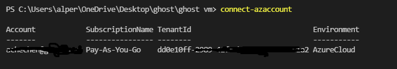
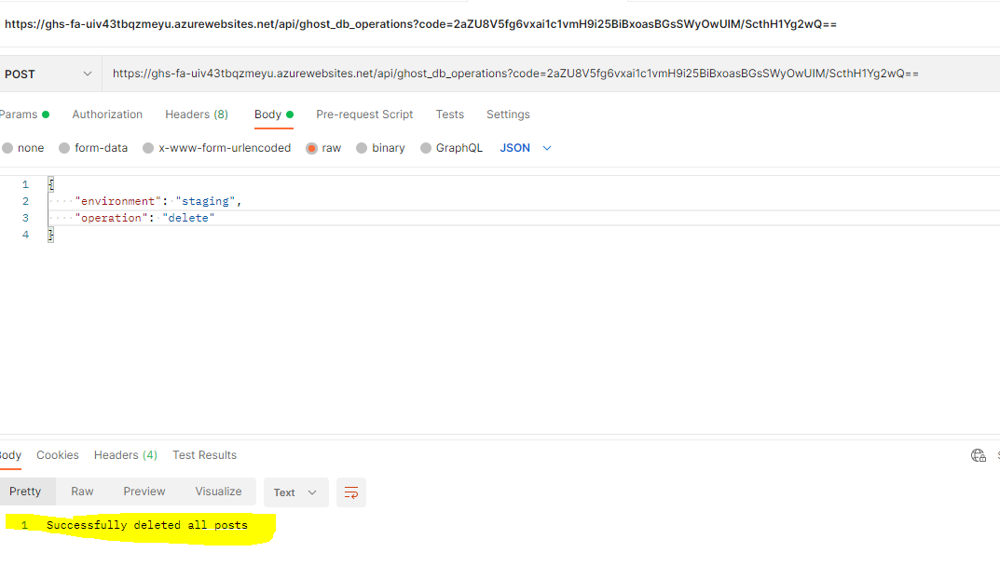

# Introduction

This project consists of **bicep** code that provisions the following **Azure** resources:
- A **Virtual Machine** with 2 instances (production and staging) of **Ghost** blog installed and configured
- Two instances of **Azure Front Door** with caching enabled (one for each instance of Ghost)
- A **static public IP** address attached to the network interface of the VM
- An **Azure Database for MySQL** instance that hosts both production and staging Ghost databases
- A **Python Function App** hosted on an **App Service Plan** with an Azure function that performs two operations: **move blog content (posts and blog settings) from staging instance to production instance** and **delete all posts** on a given Ghost instance. The code for this Azure function is hosted in a different repo: https://github.com/achechen/ghostoperations


# Architecture

## Rationale
There are multiple ways of provisioning a Ghost instance:
- **Ghost Pro** - fully managed PaaS offering by Ghost vendor
- **Digital Ocean** VPS installation
- **Linode** VPS installation
- Install on **Ubuntu server**
- **Docker** container
- **Local** developer installation

At the time of writing there is no vendor provided marketplace image with pre-installed Ghost in Azure Marketplace. There are 3 possible ways to provision a Ghost blog on Azure:
- Install on an **Azure Virtual Machine**
- Install on an **Azure Container Instance**
- Install as an **Azure Web App**

Installing Ghost in a container or as a Azure Web App may seem better solutions than installing it on a virtual machine, but they have their own disadvantages. 

Ghost is not exactly made to be provisioned as an **Azure Web App** and some modifications to the source code are needed in order for it to successfully run as one. There are multiple 3rd party repositories on the internet that do that but this creates additional 3rd party dependencies.

Ghost can also  be installed on an **Azure Container Instance** and there is even a vendor provided Docker image. The disadvantage is that the image does not contain Application Insights related tools and in case someone wanted to monitor their application, they would need to create their own Docker image based on vendor image and maintain it.

For above reasons, I believe installing Ghost on an **Azure Virtual Machine** is the way to go. Ghost can be installed on a relatively small server (at least 1 GB per Ghost instance). Ghost also **does not support load-balanced clustering or multi-server setups**. The recommended approach to achieve scale, performance and high availability is to **use a cache in front of the server**. Because Ghost almost entirely serves static content, with a correctly configured cache, very little traffic would reach the server itself.

## Infrastructure

### Virtual Machine
Both **staging** and **production** instances of Ghost are hosted on a single virtual machine. The virtual machine hosts Ubuntu 18 and has a static public IP address attached to its NIC.

### Caching & CDN
For each Ghost instance, an **Azure Front Door** with caching is provisioned (Azure Front Door for staging instance can be removed for cost optimisation. However, in my proof-of-concept implementation it is necessary because it supplies me with a public DNS domain name, which I do not currently have.)

### Database
For database I am using an **Azure Database for MySQL** instance. This is a managed MySQL service with built in high availability, redundancy, disaster recovery and backup. Both staging and production databases are hosted on the same instance. For cost optimisation, the database can be hosted locally on the virtual machine. This of course requires changes to the bicep and shell code. The database instance only allows connections from the virtual machine. Other connections are rejected by default.

### Operations and Automation
To automate performed operations on the instances, a **Python Function App** hosted on an **App Service Plan** with an Azure function was implemented.
This function currently performs two operations: **move blog content (posts and blog settings) from staging instance to production instance** and **delete all posts** on a given ghost instance. The code for this Azure function is hosted on a different repo: https://github.com/achechen/ghostoperations.
New operations such as moving the **content** folder (contains uploaded images, files, etc.) from staging to production instance could be added in the future to further automate the release process.

### High Availability and Scalability
Ghost **does not support load-balanced clustering or multi-server setups**. The recommended approach to achieve scale, performance and high availability is to **use a cache in front of the server**. For this reason, Azure Front Door with caching enabled is used.


### Backup and Disaster Recovery
This proof of concept does not include any resources for backup and disaster recovery. **Azure Site Recovery** service can be used to adopt a business continuity and disaster recovery strategy. Azure Site Recovery can replicate the virtual machine to a secondary region. This way when a regional outage occurs, you can fail over to the secondary region.

### Monitoring
This proof of concept does not include any resources for monitoring. **Azure Monitor** and **Application Insights** can be leveraged to provide monitoring for the infrastructure as well as the application.

## Architecture Diagram


## Infrastructure as Code
The whole infrastructure is described as **bicep** code and can be provisioned from this code at once. A **bash script** was developed to perform operations inside the virtual machine (package installation, configuration of Ghost, etc.). This script is passed to the virtual machine as **custom data** and executed by **cloud-init** during first boot. Provisioning of the whole infrastructure **takes about 15 minutes**. (Azure Resource Manager deployment will finish in a couple of minutes, however, installation and configuration inside the virtual machine takes up to 15 minutes.)

Azure function is hosted in a different repository which has Git integration, therefore any changes made to the code in that repository will be **automatically deployed**.

# Installation

## Prerequisites
- An **Azure subscription**
- A pre-created **Azure resource group** (**Tested on East US region only but should work on other major regions too**)
- A pre-created **vNET** in the **same resource group** where the resources will be provisioned
- A pre-created **subnet** attached to the mentioned vNET
- A way to deploy bicep code into Azure (I'm using PowerShell 5.1 with Az PowerShell module version 7.1.0 and manually installed Bicep CLI. See documentation on Bicep here: https://docs.microsoft.com/en-us/azure/azure-resource-manager/bicep/install)

## Installation (Deployment) Instructions
The following instructions assume that you are provisioning the bicep code with **PowerShell**.

- Run ```Connect-AzAccount```. A popup window will open. There, log into your Azure account if you are not already logged in.
It should automatically select your subscription. If you have more than one subscription the first one from the list will be selected.

- Run ```Set-AzDefault -ResourceGroupName <your-resource-group-name>```.
**Make sure that this resource group contains a virtual network and subnet that you can use. Otherwise create them manually first.**
- Go to the folder where you have cloned this repository and run:
  ```New-AzResourceGroupDeployment -TemplateFile .\ghostStack.bicep```
- Enter the required parameter values
  - **prefix:** A prefix that will be used to generate uniqe resoure names. Keep it short. Example: ***g***
  - **adminUsername:** Enter an administrator username for the virtual machine. Example: ***myadminuser***
  - **adminPassword:** Enter an administrator password. See: https://docs.microsoft.com/en-us/azure/virtual-machines/linux/faq#what-are-the-password-requirements-when-creating-a-vm- for password requirements.
  - **virtualNetworkName:** Enter the name of the VM's virtual network. **It should be inside the same resource group.** Example: ***ghost-vnet***
  - **subnetName:** Enter the name of the VM's subnet. Example: ***ghost-subnet***
  - **siteName:** Enter the name of your website. **NOT the url.** Example: ***mysite*** Note: This value will be prepended with ***staging_*** for the staging instance. So, if the production instance is ***mysite***, the staging instance will be ***staging_mysite***
  - **siteUrl:** Enter the URL of your website. **NO https://,, etc.** Example: ***mysite.local*** or ***mysite.com***. Note: This value will be prepended with ***staging_*** for the staging instance. So, if the production instance is ***mysite.local***, the staging instance will be ***staging_mysite.local***
  - **dbUser:** Enter the database administrator username. Example ***mydbuser***
  - **dbPassword:** Enter the database administrator password. The password must be 8 to 128 characters long and contain a combination of uppercase or lowercase letters, numbers, and non-alphanumeric characters (!, $, #, %, and so on).
  - **ghostAdminUser:** Enter the full name of the site administrator. Example: ***John Doe***
  - **ghostAdminPassword:** Enter the password of the site administrator. Same rules as the database password apply.
  - **ghostAdminEmail:** Enter the e-mail address of the site administrator. Example: ***john@example.com***

- Wait for the deployment to complete. **Azure Resource Manager deployment itself will take about 5 minutes but installation and configuration of all components within the VM will take about 15 minutes.**
  Outputs:  
  - **virtualMachineName:** The name of the provisioned VM.
  - **virtualMachinePublicAddress:** Public IP address of the VM.
  - **ghostProductionAddress:** Front Door frontend address of Ghost **production** instance **(the blog will be live under this address within 15 minutes)**
  - **ghostStagingAddress:** Front Door frontend address of Ghost **staging** instance **(the blog will be live under this address within 15 minutes)**
  - **functionUrl:** The URL of the Azure function app that contains automation to delete all posts and move content from staging to production.


## Post-Installation Checks
- Check if both instances are online. Use **ghostProductionAddress** and **ghostStagingAddress** urls. **NOTE: It may take up to 15 minutes.**
  
- Check if you can log in as an administrator to both instances using this URL: ```http://<ghostProductionAddress or ghostStagingAddress value>/ghost``` and credentials you entered as inputs (```ghostAdminEmail``` and ```ghostAdminPassword```). 
  **NOTE: Because staging and production instances use the same cookies, you may not be able to log into the same instances on the same browser session. Use different browsers or private mode.** 
  **NOTE2: If you see a setup screen instead of the login screen, It means that the auto setup operation was not completed yet. Wait until you see the below login screen. DO NOT PERFORM THE SETUP YOURSELF.**
  
- You can also check if the instances are running OK by logging into the VM and running ```ghost ls``` command:
  

## Executing Automation Functions
- Log into Azure portal, find the function app and go to **Functions**. You should be able to see a **ghost_db_operations** function in the list. **Note: It may take a while for this function to show up if the provisioning has just finished. Keep refreshing.**
  
- Click on the function and while on the function page, click on **Get Function Url** button and copy the url.

- Use a REST client (such as Postman) to send requests to this URL.

- You can also test the function directly on Azure Portal in the **Code + Test** section.

The function app can perform 2 operations: **delete all posts** and **move all posts from staging to production**:
### Delete All Posts
Send a POST request with the following payload (**environment** can be either ***staging*** or ***prod***):
```
{
    "environment": "staging",
    "operation": "delete"
}
```

### Move Posts from Staging to Production
Send a POST request with the following payload (There is no **environment** parameter):
```
{
    "operation": "move"
}
```

# Important Points to Consider for a Production Implementation
- Connections to the virtual machine are not restricted by any Network Security Groups. Create and attach a Network Security Group which will allow only connections from specific IP addresses (company network) on port 22 and deny the rest.
- Because this is a proof of concept, SSL and domain name configuration was ignored. These should be configured in a production environment. Ghost blog should be configured with an SSL certificate and a registered domain name.
- Because this is a proof of concept, mail configuration was ignored. It is assumed that in a production implementation there will be a company SMTP server that will be able to handle e-mails sent by Ghost.
- Because all traffic will go through Azure FrontDoor, direct connections to the virtual machine should be blocked (by the use of NSGs).

# Improvement Ideas
Ghost keeps blog posts and frontent configuration in the database. Images, uploaded files and templates are kept on the disk, in **content** folder. Therefore, for a real release, moving posts and frontend configuration from staging to production may not be enough. Therefore, there should also be an automation process that copies content folder from staging to production during the release of a new version of the website.

Furthermore, if custom templates will be developed, these templates need to be built, deployed and tested, which would require further automation with possible continuous integration and deployment tools.